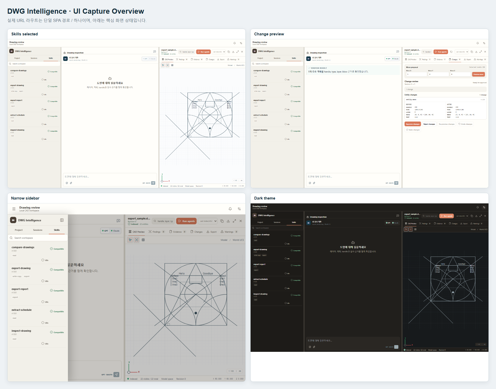

# DWG Intelligence

Local-first DWG/DXF inspection workspace. A deterministic parser produces a
versioned CAD index; agents and OAuth CLI providers may reason over that index,
but never invent or directly decode drawing geometry.



## Start here

Requirements: Node.js 24+, npm, .NET 9 SDK, and Playwright Chromium for browser
tests.

```powershell
npm install
npm run verify
npm run test:e2e
```

The default `npm test` suite includes fixture hash integrity checks.
`npm run test:fixtures` remains available for a targeted fixture-only run.

`npm run test:e2e` drives the browser suite against the repository default
drawing. Select another drawing, or forward any Playwright argument, from the
command line:

```powershell
npm run test:e2e -- --drawing tests/fixtures/dxf/minimal-architectural.dxf
npm run test:e2e -- --drawing tests/fixtures/dwg/export_sample.dwg save-as --headed
```

`--drawing` takes a repository-relative path and is the only way the browser
suite chooses a drawing; the configuration never pins one. Browser fixtures
assert against the repository default drawing, so a different drawing is for
targeted runs rather than a full green suite.

Save As writes a copy and then proves the copy matches the active document.
Writing a DXF from a DWG is verified: the index projects an XY-plane HATCH's
OCS elevation onto world Z instead of retaining ACadSharp's format-specific
bounding-box artifact, so its DWG and DXF readers agree. Writing a DWG from a
DXF is withheld, because a DXF is indexed as `cad-index/v0.1` by the legacy
indexer while a DWG can only be read as
`cad-index/v0.2`, and the two entity models cannot be compared. `GET
/api/export/capabilities` reports the withheld pairing with a reason, and
`export.drawing` rejects it with `EXPORT_UNSUPPORTED` regardless of what the
capability list advertised. Report export is available for every format.

Run the local application in two terminals:

```powershell
npm run gateway
```

```powershell
npm --workspace @click-around/workspace run dev
```

Default URLs are `http://127.0.0.1:4317/api/health` and
`http://127.0.0.1:4173/`. Override them with `DWG_GATEWAY_PORT` and
`DWG_FRONTEND_PORT`.

Run the checked-in read-only drawing inspection example from the repository
root:

```powershell
npm run skill -- --skill inspect-drawing --input skills/inspect-drawing/examples/input.json
```

The example uses the retained repository-relative DXF fixture and emits one
bounded summary without paths or raw CAD output.

## Repository map

| Path | Owner | Cross-repository access |
|---|---|---|
| `packages/contracts` | Runtime-neutral DTOs and validators | Public: `@dwg/contracts` |
| `packages/skill-contracts` | Skill manifest DTOs and validators | Public: `@dwg/skill-contracts` |
| `packages/test-kit` | Shared CAD fixture kit | Tests only |
| `modules/dwg-parser` | ACadSharp DWG parsing and normalized geometry extraction | Internal parser implementation |
| `modules/cad-io-acadsharp` | ACadSharp writer host and typed process bridge | Internal; writes verified copies |
| `modules/cad-document` | Engine-neutral CAD document snapshot | Internal module boundary |
| `modules/cad-edit` | Deterministic edit commands, previews, undo/redo | Internal module boundary |
| `modules/cad-query` | Deterministic reads over a document snapshot | Internal module boundary |
| `modules/cad-export` | Deterministic report and drawing export shapes | Internal module boundary |
| `modules/cad-capabilities` | Permissioned capabilities, save coordination, output verification | Internal module boundary |
| `modules/skill-runtime` | Skill discovery, manifest validation, bounded execution | Internal module boundary |
| `skills` | Built-in skill roots (`SKILL.md` + `manifest.json`) | Loaded by the skill runtime |
| `modules/cad-runtime/src/parsers` | DWG/DXF adapters | Internal; returns contract DTOs |
| `modules/cad-runtime/src/application` | Deterministic CAD tools and grounded chat use cases | Internal application boundary |
| `modules/cad-runtime/src/http` | Loopback gateway | Public process boundary: loopback `/api` |
| `modules/cad-runtime/src/mcp` | Read-only CAD MCP tools | Public process boundary: MCP stdio |
| `modules/cad-runtime/src/providers` | Existing Codex/Claude OAuth CLI adapters | Internal `ChatProvider` implementations |
| `apps/workspace/src/app` | Three-panel composition and workspace controls | Public only as the whole apps/workspace composition |
| `apps/workspace/src/features` | Drawing, viewer, chat, and inspection feature owners | Internal feature modules |

Supported reuse surfaces are `@dwg/contracts`, `@dwg/skill-contracts`, loopback
`/api`, MCP stdio, and whole apps/workspace composition. Do not deep-import
`modules/cad-runtime/src/**`, `apps/workspace/src/features/**`, the CAD
capability modules, or parser internals. Taking a package surface into another
repository means taking its declared dependencies with it; see
[AI clone and cross-repository handoff](docs/architecture/ai-clone-handoff.md).

## Architecture and handoff

- [Repository instructions for AI agents](AGENTS.md)
- [Portable repository memory](docs/handoff/repo-memory.md)
- [Embed this repository as one folder](docs/handoff/embedding-as-submodule.md)
- [AI clone and cross-repository handoff](docs/architecture/ai-clone-handoff.md)
- [Module ownership and import rules](docs/architecture/module-boundaries.md)
- [Cross-repository integration contract](docs/architecture/integration-contract.md)
- [OAuth CLI provider boundary](docs/architecture/oauth-cli-providers.md)
- [Reproducible UI captures](docs/ui-captures/README.md)
- [Fixture provenance](tests/fixtures/dwg/README.md)

Source DWG/DXF files are read-only. Object-level claims must be grounded with
stable handles, layers, types, and bounding boxes from the versioned CAD
contract: DWG emits `cad-index/v0.2`; legacy DXF may emit `cad-index/v0.1`.

When cloning this repository into another project, choose exactly one supported
reuse surface. Do not deep-import internal parser, runtime, or workspace
feature folders, and do not duplicate public DTOs.
